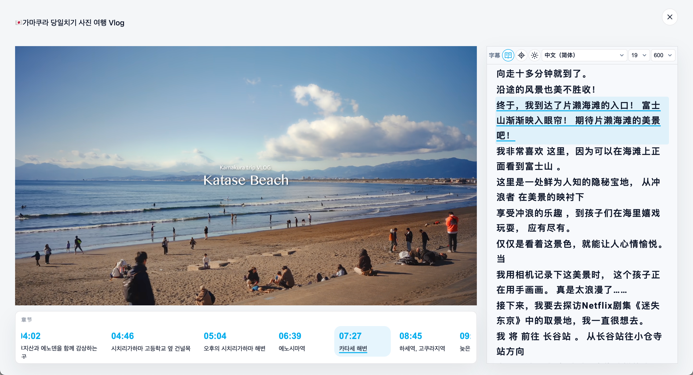
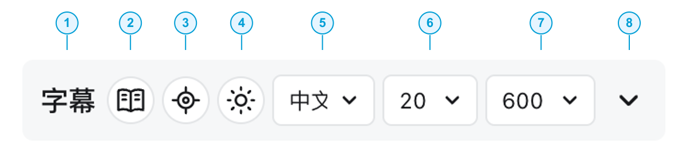
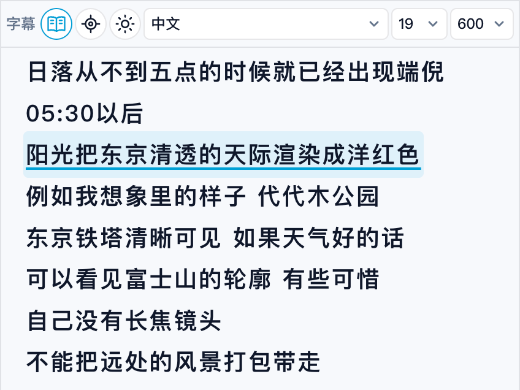
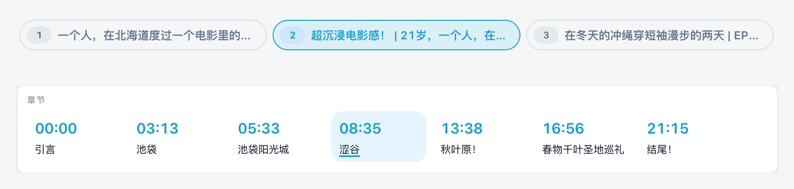
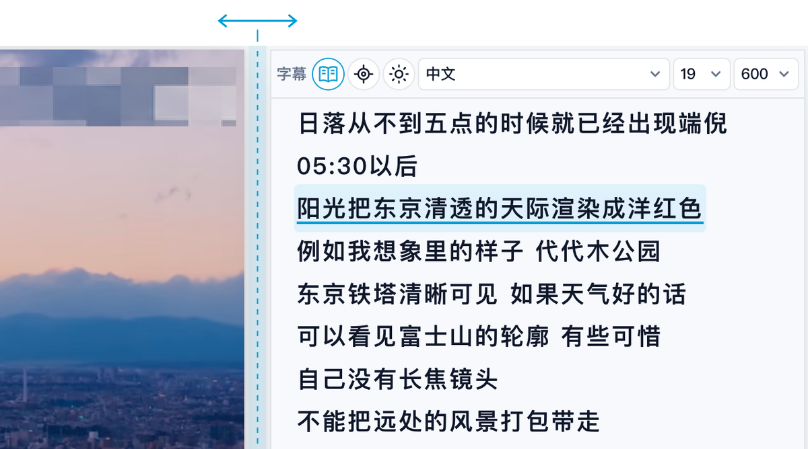

# 小书吏 ｜将哔哩哔哩与YouTube视频誊写为文章

为哔哩哔哩与 YouTube 视频带来阅读模式，将字幕展开成连续全文，让画面、文字和章节随播放联动。先浏览，再细看，或回到刚才那句话。按你的节奏来，一段课程，一场访谈，一次笔记，都从这里开始。

## 打开视频，文字就在旁边。

熟悉的播放页，多了一栏可以直接阅读的字幕。展开就能浏览全文，收起便能继续看视频。

<!-- 配图 02A：哔哩哔哩普通播放页，展示弹幕列表上方的字幕面板、书本入口和工具栏。 -->

<!-- 配图 02B：YouTube 普通播放页，展示推荐视频上方的字幕面板、书本入口和工具栏。 -->

## 沉浸阅读，把注意力留给内容。

<!-- 配图 01A：哔哩哔哩阅读模式全景，展示原生播放器、连续字幕和当前播放高亮。 -->

点击「字幕」右侧的书本按钮，即可进入阅读模式。

<!-- 配图 01B：YouTube 阅读模式全景，展示原生播放器、连续字幕和已有章节。 -->

## 字幕工具栏，随手就会。

工具栏从左到右，依次是「字幕」、阅读模式切换、定位当前字幕、主题、字幕语言、字号、字重以及展开。

## 看得连贯，读得完整。

字幕以连续全文呈现，方便快速浏览内容，也方便回看前后的解释。播放到哪里，文字就高亮到哪里。

看到感兴趣的地方，点击那句话，视频便会跳转到对应时刻。手动滚动字幕时，自动跟随会暂时暂停；点击「回到当前字幕」，就能回到正在播放的位置。

## 长视频，也有清晰的脉络。

视频已有的章节显示在播放器下方，当前章节随播放高亮。点击章节，直接抵达想看的部分。

多分集合集还会在阅读视图顶部显示分集列表，让一整套课程或系列视频接着看、接着读。

<!-- 配图 05A：从阅读模式截图中分别裁出顶部合集与底部章节栏，上下排列展示。 -->

## 给画面和文字，恰好的空间。

阅读模式下，视频与字幕并排呈现。拖动中间的分隔条，就能调整两侧宽度，让画面或文字多一点空间。视频保持原始比例，章节区域也随视频宽度调整。

## 几步安装，就能开始。

1. 在浏览器中安装 **脚本猫（ScriptCat）** 或 **Tampermonkey（篡改猴）** 扩展。
2. 打开小书吏的[脚本猫](https://scriptcat.org/zh-CN/script-show-page/8038)或 [Greasy Fork](https://greasyfork.org/zh-CN/scripts/596599-bilibili-reader-%E5%93%94%E5%93%A9%E5%93%94%E5%93%A9%E9%98%85%E8%AF%BB%E6%A8%A1%E5%BC%8F)，点击「安装脚本」。
3. 在脚本管理器中确认安装。
4. 打开哔哩哔哩或 YouTube 的视频播放页，等待字幕面板加载。

## 关于字幕与支持范围。

支持 Bilibili 以及 YouTube 视频播放页，字幕、章节取决视频本身是否提供。

- **B 站字幕**：读取当前视频可用的字幕轨道。
- **YouTube 字幕**：仅使用视频提供的非自动生成字幕。只有自动生成字幕的视频会提示「当前视频无字幕」。
- **字幕语言**：可选语言取决于视频本身提供的字幕。
- **没有字幕**：普通播放页的字幕面板会自动收起，仍可进入阅读模式，使用视频已有的章节。
- **没有章节**：阅读模式保留视频与字幕，不显示章节区域。
- **加载失败**：普通播放页的字幕面板提供「重试」入口。
